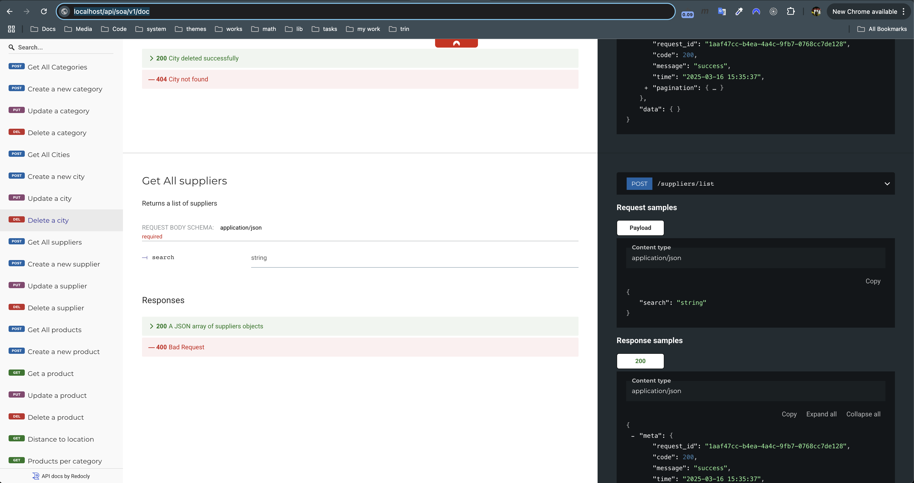

# ENV

```
APP_ENV=dev
BASE_PATH=/api/soa/v1/

SERVER_PORT=80

DB_DRIVER=
DB_HOST=
DB_PORT=
DB_USER=
DB_PASS=
DB_NAME=

REDIS_HOST=
REDIS_PORT=
REDIS_PASS=
REDIS_INDEX=
REDIS_CLUSTER=

```

- Need Redis to Incr, Decr statistics

# Swagger

- [swagger.yaml](swagger.yaml)
- Can access to http//{host}{BASE_PATH}/doc => to view



# Source code 

- tools: 
    - go-kit https://gokit.io/
    - bun https://bun.uptrace.dev/
    - geoip2-golang https://github.com/oschwald/geoip2-golang ([GeoLite2-City.mmdb](GeoLite2-City.mmdb))
- Structure
  - [cmd](cmd)
    - [cmd.go](cmd%2Fcmd.go): migration command line manually
    - [main.go](cmd%2Fmain.go): main app
  - [cfg](cfg): config
  - [internal](internal)
    - [kit](internal%2Fkit): go-kit directory
      - [endpoints](internal%2Fkit%2Fendpoints): go-kit endpoint (can mapping as controller)
      - [services](internal%2Fkit%2Fservices): go-kit service (biz logic)
      - [transports](internal%2Fkit%2Ftransports): go-kit transport (can be https/gRPC)
    - [models](internal%2Fmodels): database models
    - [transforms](internal%2Ftransforms): mapping request
  - [migrations](migrations): migration file version
  - [pkgs](pkgs): external func
  - [server](server): init app